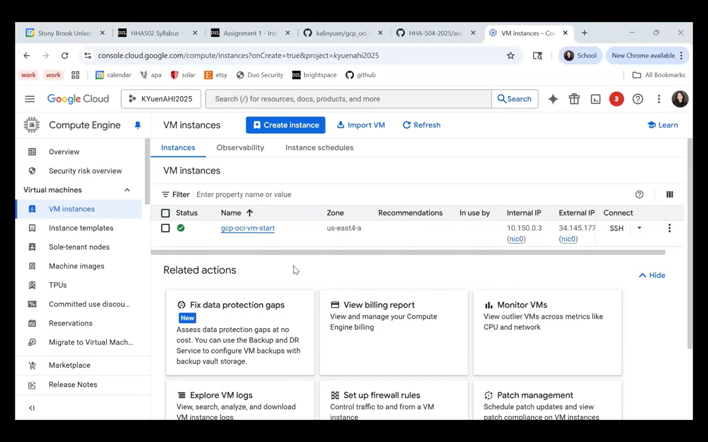
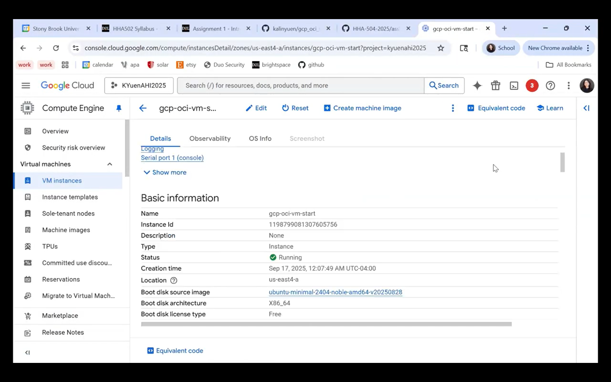
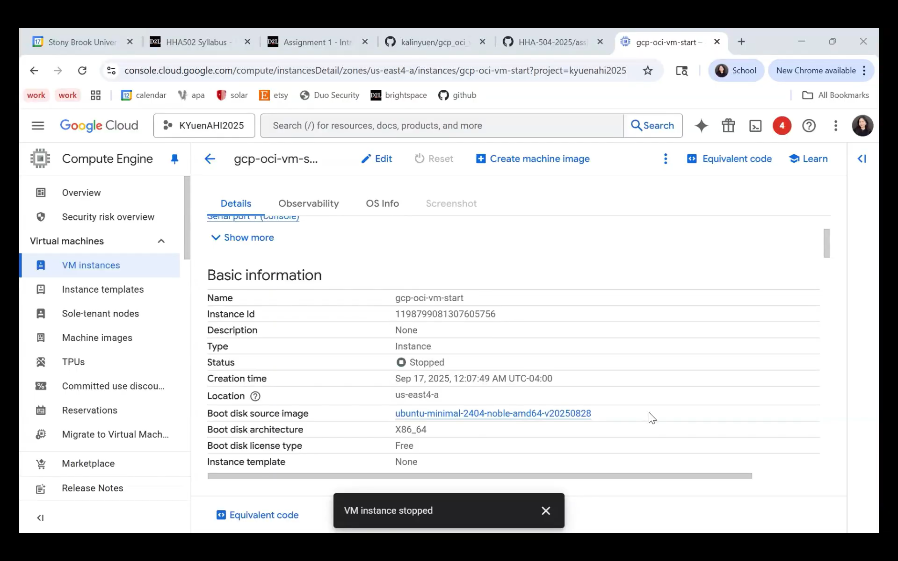
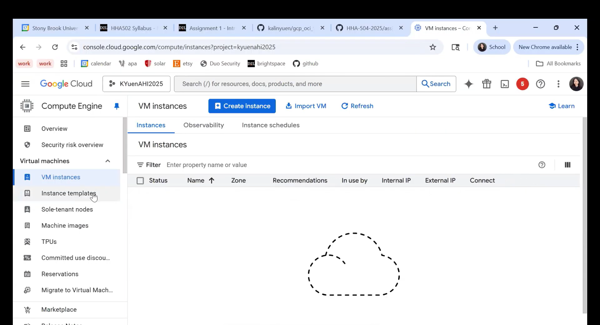
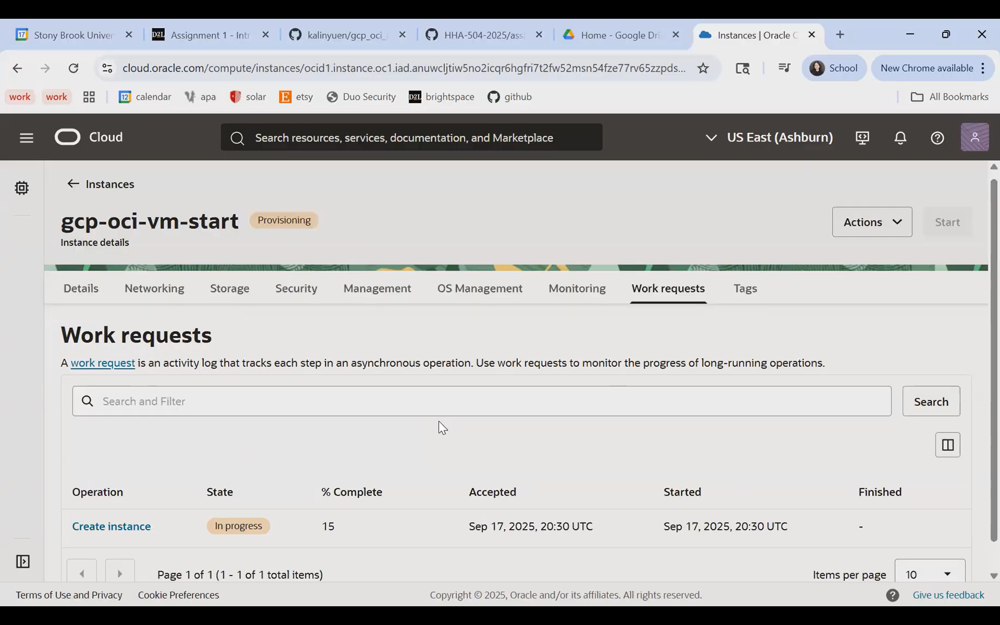
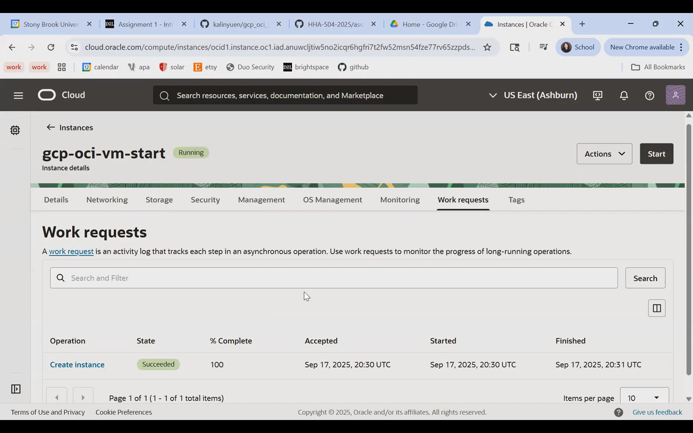
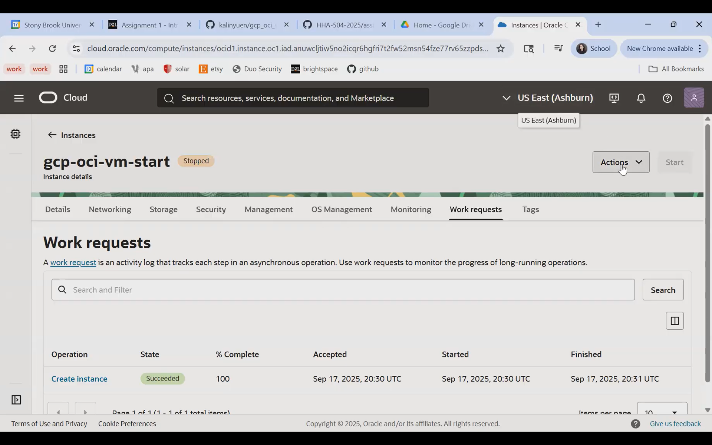
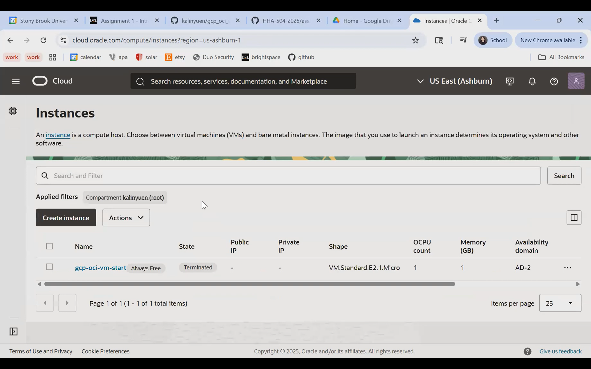
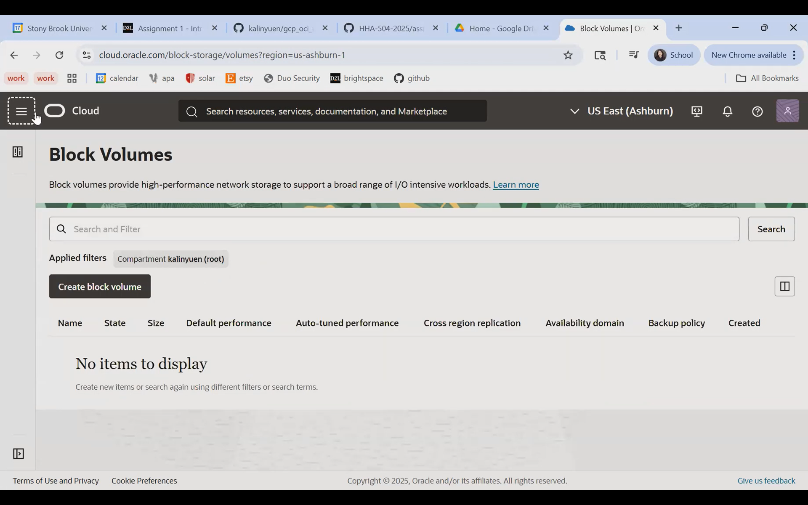

# VM Lifecycle on GCP and OCI — Tutorial

## Video

Google Cloud Platform:[ How to Create GCP Virtual Machine](https://drive.google.com/file/d/1E83KevbvMDsXQkmejsKRXEJ-J0SNLJnU/view?usp=sharing)

Oracle Cloud Infrastructure:[ How to Create OCI Virtual Machine + Discussion](https://drive.google.com/file/d/1kxVFV-Cn3bUNaAY6S66MKiYkDXeostm9/view?usp=sharing)

## Prereqs
- Cloud access to GCP and OCI
- No PHI/PII; smallest/free-tier shapes

---

## Google Cloud (GCP)
### Create
1. Console → Compute Engine → Create instance
2. Region/zone: us-east4/Any
3. Machine type: E2
4. Image: Ubuntu LTS
5. Boot disk: default minimal
6. Network: default VPC; ephemeral public IP

### Start/Stop
- Start: 

- Stop:

### Delete
- Delete instance and verify no disks/IPs remain

---

## Oracle Cloud (OCI)
### Create
1. Compartment: kalinyuen
2. Networking: VCN with Internet Connectivity (defaults)
3. Shape: VM.Standard.E2.1.Micro
4. Image: Ubuntu
5. Public IP:
6. Boot volume: default minimal

### Start/Stop
- Start:

- Stop: <state shows STOPPED>

### Terminate
- Terminate and delete boot volume; verify cleanup

- Cleaned:

---

## Reflections
### Similarities
- GCP and OCI both use a fairly standard flow for creating VMs (pick machine/type, configure networking, attach storage, and then launch instance)
- Terminology are similar such as compute instance and block storage/boot disk.

### Differences
- Naming: OCI uses shapes for VM configurations and compartments for organization, while GCP uses machine types and projects. For networking OCI uses VCNs while GCP uses VPCs. 
- Defaults: GCP has more pre-set defaults, while OCI requires more manual setup.
- Quotas: GCP has stricter quotas on free-tier VM usage while OCI is more generous with its "Always Free" tier. 
- UX: GCP's interface is more beginner-friendly while OCI's can be more complicated with more steps. 

### Preference (OCI vs GCP) and Why
- For a beginner who wants a tiny VM up and running quickly, I prefer to use GCP. Its interface is clearer, the defaults make setup much faster, and the documentation is easier to follow. Even though OCI offers more generous free-tier quotas, the extra steps and learning curve can be confusing for a beginner. 